# Accident Detection System

> An Android application that uses GPS-based speed monitoring and a multi-layer pattern-recognition algorithm to automatically detect vehicle accidents and dispatch emergency alerts — even when the screen is off or the app is in the background.

---

## Screenshots

| Splash | Login | Register |
|:---:|:---:|:---:|
| 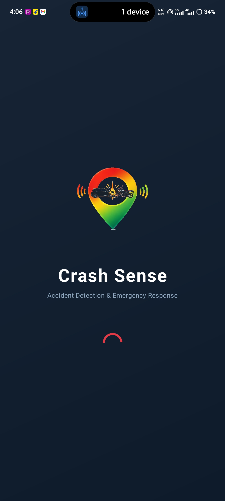 | 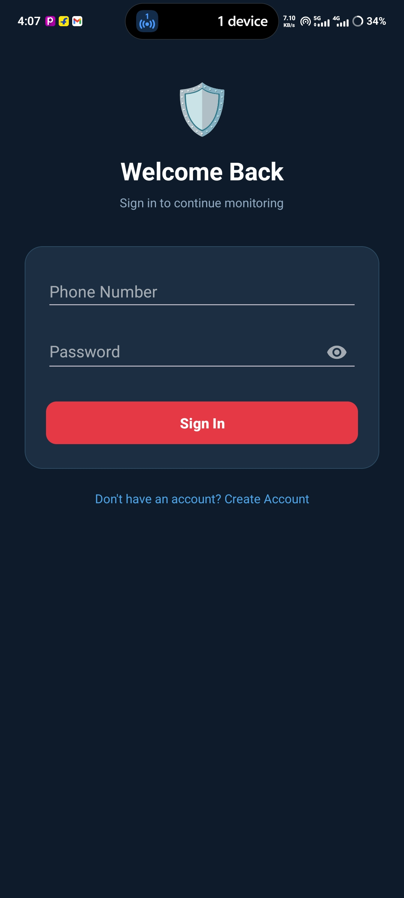 | 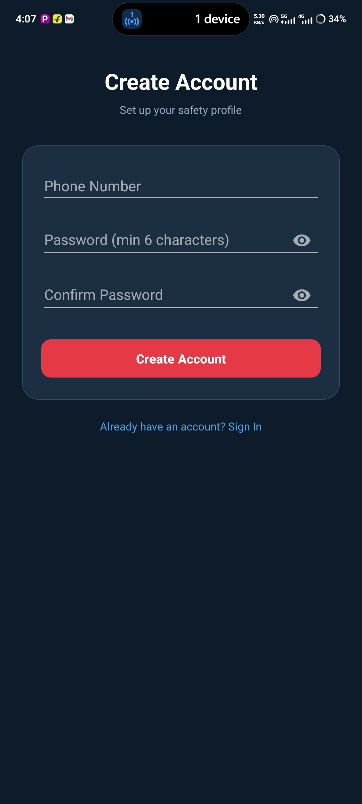 |

| User Info | Emergency Contacts | Speed Limit |
|:---:|:---:|:---:|
| 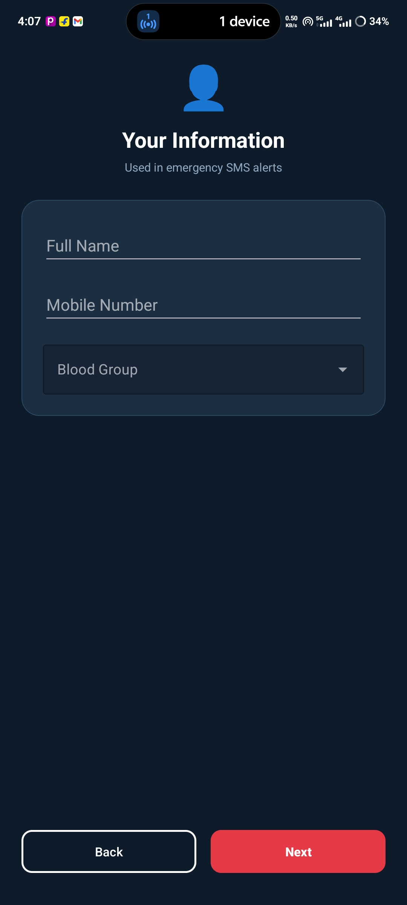 | 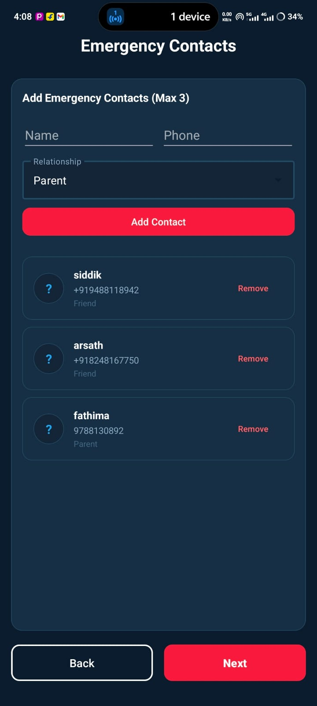 | 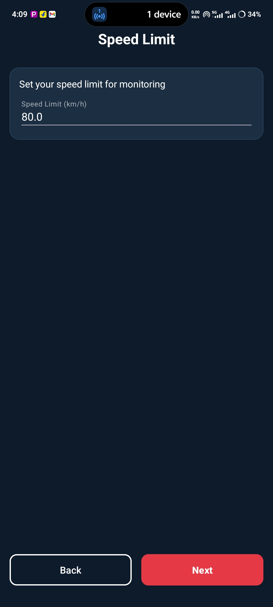 |

| Speed Monitoring | Accident Alert | Emergency Info |
|:---:|:---:|:---:|
| 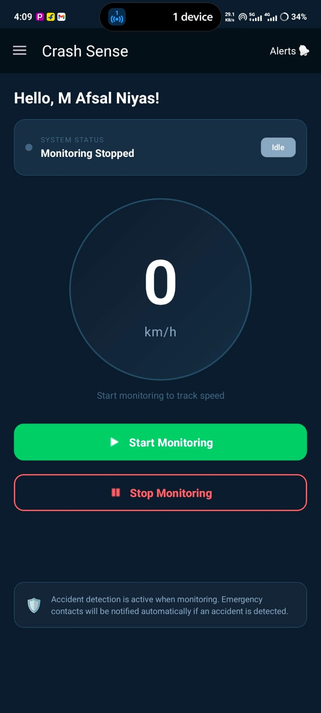 | 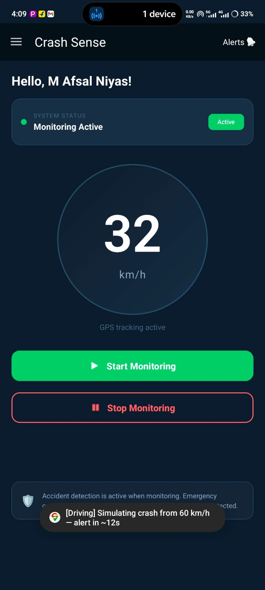 | 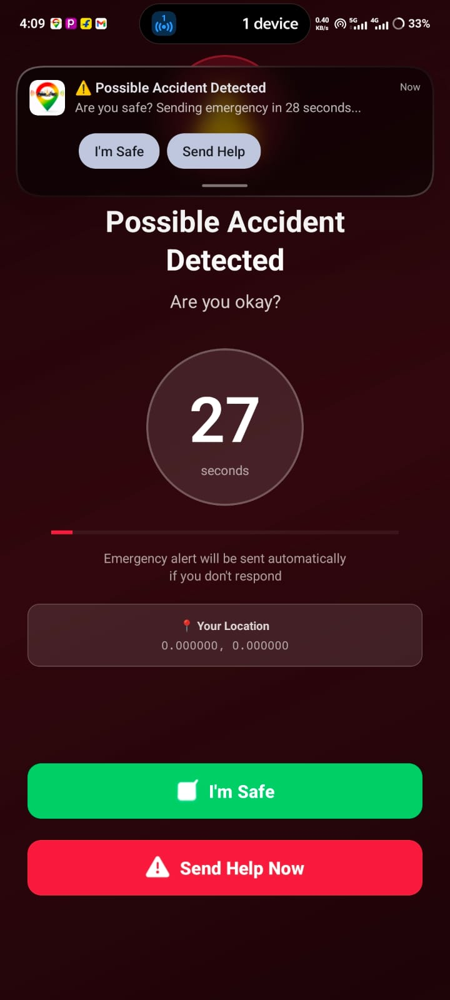 |

| Notifications | Navigation Drawer |
|:---:|:---:|
| 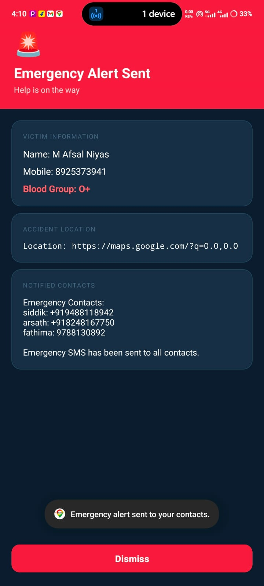 | 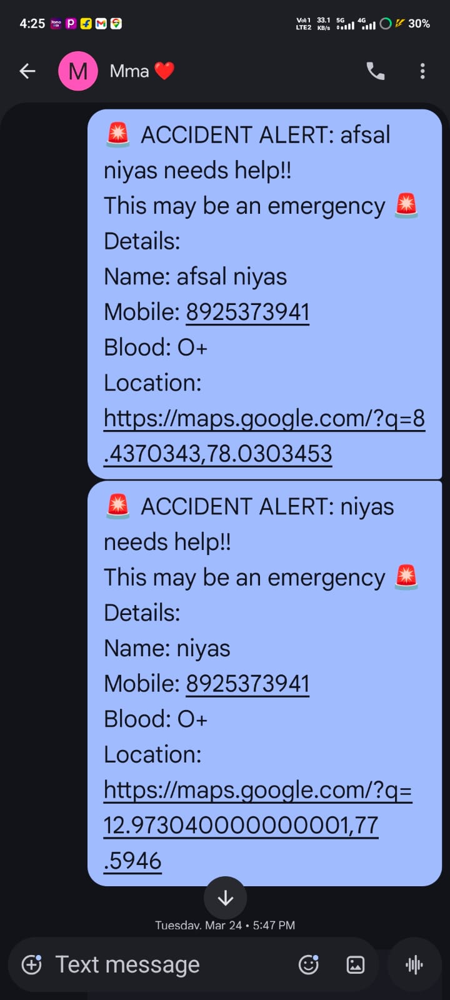 |

---

## Features

**Core Detection**
- 3-layer GPS accident detection: high speed → sudden deceleration → stop confirmation
- Raw GPS Doppler speed fed to detector (unaveraged) to preserve crash signature
- Tuned thresholds: 30 km/h high-speed gate, 20 km/h drop threshold, 5-second stop window
- GPS Doppler compensation: thresholds lowered from 35/25 km/h to account for real GPS reading ~10% below actual vehicle speed
- False-positive prevention: vehicle must stay stopped (<5 km/h, <10 m movement) for 5 full seconds

**Speed Monitoring**
- Real-time speed display updated every 1 second
- Hybrid speed engine: GPS Doppler for vehicles, distance-based for walking/stationary
- Configurable speed limit warning with heads-up notification
- Spike filter, accuracy filter, and stop detection built in

**Emergency Response**
- Full-screen alert over lock screen with 30-second countdown
- Escalating beeps + continuous vibration during countdown
- "I'm Safe" and "Send Help" buttons on both the activity and the notification
- Auto-dispatch if no user response within 30 seconds
- SMS sent to all emergency contacts with Google Maps location link

**Firebase & Cloud**
- Firebase Realtime Database: emergency events, user data, contacts
- Firebase Cloud Functions: push notifications, SMS stub (Twilio-ready), email stub
- FCM push notifications to all user devices on emergency
- Offline persistence enabled

**User Management**
- Local phone number + password authentication (SHA-256 hashed)
- Per-user SharedPreferences isolation
- User profile: name, phone number, blood group
- Up to 3 emergency contacts with name, phone, and relationship type

**Testing & Simulation**
- Long-press speed display to open simulation menu
- 3 simulation profiles: Driving (60 km/h), Highway (100 km/h), Full Test (65 km/h)
- 8 instrumented test scenarios covering true positives, false positives, and edge cases

---

## Tech Stack

| Layer | Technology |
|-------|-----------|
| Language | Kotlin |
| Min SDK | 26 (Android 8.0) |
| Target SDK | 35 (Android 15) |
| Location | Google Play Services — FusedLocationProvider |
| Backend | Firebase Realtime Database, Cloud Functions (TypeScript) |
| Push | Firebase Cloud Messaging (FCM) |
| Auth | Local SHA-256 + Firebase Auth (available) |
| UI | Material Design 3, ViewBinding, Navigation Drawer |
| Build | Gradle (Kotlin DSL) |

---

## Architecture

```
┌──────────────────────────────────────────────────────────────────┐
│                          UI Layer                                │
│  SplashActivity → LoginActivity / RegisterActivity               │
│  → UserInfoActivity → EmergencyContactsActivity → SpeedLimitActivity │
│  → SpeedMonitoringActivity (main screen, navigation drawer)      │
└───────────────────────────┬──────────────────────────────────────┘
                            │ startForegroundService / Broadcasts
┌───────────────────────────▼──────────────────────────────────────┐
│                     TrackingService (Foreground, START_STICKY)   │
│                                                                  │
│  FusedLocationProvider ──► ImprovedSpeedCalculator               │
│  (1s interval, 500ms fastest)   (hybrid GPS+distance engine)     │
│                          │                                       │
│                    averaged speed ──► UI broadcast               │
│                    raw GPS speed  ──► AccidentDetector           │
│                                          │                       │
│                          SpeedMonitor ◄──┘                       │
└───────────────────────────┬──────────────────────────────────────┘
                            │ onAccidentDetected
┌───────────────────────────▼──────────────────────────────────────┐
│                   AccidentAlertActivity                          │
│         (full-screen, over lock screen, wakes display)           │
│  "I'm Safe" → reset detector                                     │
│  "Send Help" / auto at 0s → SMS + Firebase + Cloud Functions     │
└───────────────────────────┬──────────────────────────────────────┘
                            │
┌───────────────────────────▼──────────────────────────────────────┐
│              Firebase Cloud Functions (Node.js / TypeScript)     │
│  sendEmergencySMS  sendPushNotification  cleanupOldEmergencies   │
└──────────────────────────────────────────────────────────────────┘
```

---

## Detection Algorithm

`AccidentDetector` is a 5-state machine. All three layers must be satisfied in sequence.

```
MONITORING
  └── speed > 30 km/h
        ↓
HIGH_SPEED_DETECTED
  └── peak speed in 5s buffer > 30 km/h AND drop > 20 km/h
        ↓
DECELERATION_DETECTED
  └── transitions to STOP_CONFIRMATION on next GPS tick
        ↓
STOP_CONFIRMATION  (5-second window)
  ├── distance moved ≥ 10 m → CANCEL → MONITORING
  ├── 5s elapsed + max speed < 5 km/h + distance < 10 m → ACCIDENT_CONFIRMED
  └── 5s elapsed + conditions not met → CANCEL → MONITORING
        ↓
ACCIDENT_CONFIRMED
  └── fires AccidentListener.onAccidentDetected()
```

Key design decisions:
- Detector receives **raw GPS Doppler speed**, not the averaged UI speed — averaging smooths out the crash signature
- Speed buffer holds last 8 readings; deceleration check finds the highest in the 5-second window, not just the previous tick — handles gradual real-world braking
- Stop confirmation tracks cumulative distance, not instantaneous speed — correctly handles GPS drift

---

## App Flow

```
SplashActivity (1.5s)
  ├── [not logged in] → LoginActivity → RegisterActivity
  └── [logged in] → MainActivity
        ├── [setup incomplete] → UserInfoActivity → EmergencyContactsActivity → SpeedLimitActivity
        └── [setup complete]  → SpeedMonitoringActivity
              ├── Navigation drawer: Edit Profile / Contacts / Speed Limit / Logout
              ├── Start/Stop monitoring
              ├── Real-time speed display (km/h)
              ├── Status chip: Idle / Active / Accident Detected / Emergency Sent
              ├── Bell icon → NotificationActivity
              └── Long-press speed → Simulation menu
```

---

## Prerequisites

- Android Studio Hedgehog or later
- JDK 11+
- Android device or emulator with API 26+
- A Firebase project (see [Firebase Setup](#firebase-setup))
- Node.js 18+ and Firebase CLI (for Cloud Functions)

---

## Firebase Setup

1. Create a project at [console.firebase.google.com](https://console.firebase.google.com)
2. Add an Android app with package name `com.example.accident_detection3`
3. Download `google-services.json` and place it in `app/`
4. Enable **Realtime Database** and set rules from `database.rules.json`
5. Enable **Cloud Messaging** (FCM)
6. Enable **Cloud Functions** (Blaze plan required)

---

## Build & Run

```bash
# Clone the repository
git clone https://github.com/<your-username>/accident-detection-android.git
cd accident-detection-android

# Open in Android Studio and sync Gradle
# Or build from CLI:
./gradlew assembleDebug

# Install on connected device
./gradlew installDebug
```

---

## Cloud Functions Setup

```bash
cd functions
npm install
firebase deploy --only functions
```

To activate Twilio SMS, edit `functions/src/index.ts` and uncomment the Twilio block, then set:

```bash
firebase functions:config:set twilio.account_sid="..." twilio.auth_token="..." twilio.phone_number="..."
```

---

## Permissions

| Permission | Purpose |
|-----------|---------|
| `ACCESS_FINE_LOCATION` | GPS speed and coordinates |
| `ACCESS_BACKGROUND_LOCATION` | Monitoring while screen is off |
| `FOREGROUND_SERVICE` | Persistent tracking service |
| `FOREGROUND_SERVICE_LOCATION` | Android 14+ foreground service type |
| `SEND_SMS` | Emergency SMS dispatch |
| `VIBRATE` | Alert vibration |
| `WAKE_LOCK` | Wake screen on accident |
| `RECEIVE_BOOT_COMPLETED` | (reserved for auto-start) |

---

## Configuration

All detection thresholds are in `AccidentDetector.kt`:

| Parameter | Value | Description |
|-----------|-------|-------------|
| `highSpeedThreshold` | 30 km/h | Minimum speed to enter monitoring |
| `decelerationThreshold` | 20 km/h | Minimum speed drop to qualify |
| `LOW_SPEED_THRESHOLD` | 5 km/h | "Stopped" speed ceiling |
| `DECELERATION_TIME_WINDOW` | 5000 ms | Window for peak-speed check |
| `STOP_CONFIRMATION_DURATION` | 5000 ms | Stop confirmation window |
| `STOP_CONFIRMATION_DISTANCE` | 10 m | Max movement during confirmation |

Speed limit default (80 km/h) is set in `SpeedLimitPrefs.kt`.

---

## Testing

```bash
# Run instrumented tests (requires connected device)
./gradlew connectedAndroidTest
```

8 test scenarios in `AccidentDetectorTest.kt`:
- True positive: highway crash, city crash, gradual braking
- False positive: hard braking without stop, speed bump, traffic slowdown
- Edge cases: GPS drift while stationary, recovery after cancel

---

## Project Structure

```
app/src/main/java/com/example/accident_detection3/
├── data/               # SharedPreferences wrappers (UserPrefs, EmergencyContactManager, …)
├── detector/           # AccidentDetector — 5-state machine
├── emergency/          # AccidentAlertActivity, EmergencyInfoActivity, NotificationActionReceiver
├── firebase/           # FirebaseManager, DatabaseHelper, FunctionsHelper, MessagingService
├── login/              # LoginActivity, RegisterActivity
├── monitor/            # SpeedMonitor (speed limit check)
├── notification/       # EmergencyNotifier (SMS dispatch)
├── service/            # TrackingService (foreground GPS service)
├── ui/                 # SpeedMonitoringActivity, EmergencyContactsActivity, …
└── util/               # Constants, ImprovedSpeedCalculator, NotificationHelper

functions/src/
└── index.ts            # Firebase Cloud Functions (TypeScript)
```

---

## Known Limitations

- SMS dispatch requires the device to have a SIM card with SMS capability
- Background location permission must be granted manually on Android 11+ (system dialog)
- Cloud Functions SMS/email are stubbed — Twilio/Nodemailer credentials required to activate
- Detection thresholds are tuned for GPS Doppler; accuracy may vary on devices with poor GPS hardware

---

## License

```
MIT License

Copyright (c) 2025

Permission is hereby granted, free of charge, to any person obtaining a copy
of this software and associated documentation files (the "Software"), to deal
in the Software without restriction, including without limitation the rights
to use, copy, modify, merge, publish, distribute, sublicense, and/or sell
copies of the Software, and to permit persons to whom the Software is
furnished to do so, subject to the following conditions:

The above copyright notice and this permission notice shall be included in all
copies or substantial portions of the Software.

THE SOFTWARE IS PROVIDED "AS IS", WITHOUT WARRANTY OF ANY KIND, EXPRESS OR
IMPLIED, INCLUDING BUT NOT LIMITED TO THE WARRANTIES OF MERCHANTABILITY,
FITNESS FOR A PARTICULAR PURPOSE AND NONINFRINGEMENT.
```
